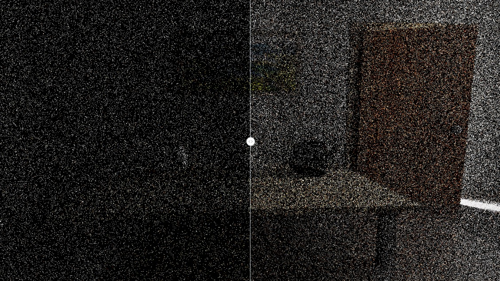

# KiRaRay

*KiRaRay* is a simple interactive ray-tracing renderer using optix. It is mainly for personal learning purpose with limited features.

### Features

> __Working in progress (?) project__  
> This project is only for learning purpose with very limited features, and not sure if it will continue developing.

- [x] Interactive orbit camera controlling.
- [x] GPU path tracing (a megakernel version and a wavefront version).
- [x] Post processing passes (e.g., tonemapping, accumulating and denoising).
- [x] Basic support for multiple scenes formats (e.g., OBJ, glTF2 and pbrt-v3).
- [x] Basic CPU/GPU performance profiling.

### Build and run

| *Windows* |  |
| --------- | ------------------------------------------------------------ |

#### Requirements

- Nvidia gpu (Turing or higher if possible).
- OptiX 7.3+ and CUDA 11.x.
- [Vulkan SDK](https://vulkan.lunarg.com/) (1.2+).

This project is only tested with optix 7.3/4 and cuda 11.4/5/6 on Windows (MSVC). It do not compile on Linux. *KiRaRay* now uses Vulkan for better interoperability with CUDA, and extensibility to rasterization-based render passes. If Vulkan is not desired, check the [legacy-GL](https://github.com/cuteday/KiRaRay/tree/legacy-GL) branch that instead depends on OpenGL.

#### Cloning the repository

*KiRaRay* uses external dependencies as submodules, so fetch them recursively with `--recursive` when cloning:

~~~bash
git clone --recursive --depth=1 https://github.com/cuteday/KiRaRay.git
~~~

#### Building

This project uses cmake to build, no additional setting is needed. Make sure cuda is installed and added to PATH. While it tries to guess the optix installation path (i.e., the default installation path), you may specify the `OptiX_INSTALL_DIR` environment variable manually in case it failed.

#### Running

Specify the json configuration file as command line argument to start the renderer. The [example](common/configs/example.json) configuration will be used if no argument is provided:

~~~bash
build/src/kiraray.exe common/configs/example.json
~~~

Render passes may contain configurable parameters that can be serialize/deserialized in to json elements. A configuration file must contain the render passes setup (expand below for an example), with some optional parameters. 

Click for example configuration 

Currently, the render passes are simply executed in a sequential manner, each with optional configurable parameters. One can always head to the source code for the detailed parameters. The following configuration shows a simplea standard render pipeline:

~~~json
{
	"model": "common/assets/scenes/cbox/cbox.obj",
	"resolution": [
		750,
		750
	],
	"passes": [
		{
			"enable": true,
			"name": "WavefrontPathTracer",
			"params": {
				"nee": true,
				"rr": 0.8,
				"max depth": 6
			}
		},
		{
			"enable": true,
			"name": "AccumulatePass",
			"params": {
				"spp": 0,
				"mode": "moving average"
			}
		},
		{
			"enable": true,
			"name": "DenoisePass"
		},
		{
			"enable": true,
			"name": "ToneMappingPass",
			"params": {
				"exposure": 5,
				"operator": "aces"
			}
		}
	],
}
~~~

One can also save the current parameters (including camera parameters, render passes and scene file path, etc.) to a configuration file via the option in main menu bar.

#### Usage

**Camera controlling.** Dragging `LeftMouse` for orbiting, dragging `Scroll` or `Shift+LeftMouse` for panning. `Scroll` for zooming in/out.

**Hot keys.** `F1` for showing/hiding UI,  `F2` for showing/hiding the profiler, and `F3` for screen shots.

**Python binding.** Several simple interfaces are exposed to python scripting via [pybind11](https://github.com/pybind/pybind11), including a wrapper of OptiX's built-in AI denoiser. See [scripts](common/scripts) for details.

### Galleries

### Algorithms

I tried to implement some algorithms designed for path tracing, during me playing with my toy renderer. Check it out at the [misc](src/misc) directory. Expand the entry below for details. 

Click to expand (・ω< )★ 

I collapsed this since they are not relevant to the main feature of *KiRaRay*, and are not interesting at all to people like me. Please do note that these code is just for playing (while I sadly find it not interesting when implementing them). These code is not performance-optimized, nor it will be maintained. Also, no guarantee for correctness, since I'm just a little noob on graphics \_(:з」∠)\_.

These additional implementations as such is not built along with *KiRaRay* by default. Turn a strange CMake option `KRR_BUILD_STARLIGHT` on (`-DKRR_BUILD_STARLIGHT=ON`) if one want to build them.

#### Path Guiding

This implements [Practical Path Guiding (PPG)](https://github.com/Tom94/practical-path-guiding), which is a path guiding algorithm targeted for offline rendering (and not that "practical" for real-time applications). What I did is largely to simply move the original implementation from CPU to GPU, and this makes its performance far from optimized. The operations that modifying the spatio-directional tree are still on host code (maybe this should be parallelized on GPU). The performance is not quite satisfying (about 70% more time per frame). 

The above image shows an 1spp rendering of a somewhat challenging scene (*veach-ajar*), where PPG is trained using MC estimates of ~500spp. The noise got reduced (maybe not much of them), but the performance also dropped drastically (only <20fps@720p on my device). The code is located [here](src/misc/render/ppg). The `PGGPathTracer` could be invoked with the configuration at [configs/misc](common/configs/misc/ppg.json). One can refer to the code implementation for all the configurable parameters:

~~~json
	"params": {
		"spp_per_pass": 4,
		"max_memory": 16,
		"bsdf_fraction": 0.5,
		"distribution": "full",
		"stree_thres": 2000,
		"dtree_thres": 0.005,
		"auto_build": true,
		"mode": "offline",
		"sample_combination": "atomatic",
		"budget": {
			"type": "spp",
			"value": 1000
		}
	}
~~~

I also implemented a later [Variance-aware](https://github.com/iRath96/variance-aware-path-guiding) enhancement, which improves PPG on the theoretical side. Use the `distribution` parameter to select from the two methods (`radiance` for standard PPG, and `full` for the variance-aware version).

### Additional Information

#### Performance

Switch to *Release* build for normal performance! The megakernel pathtracer should run at about 30 spp per second at 1920*1080 on an RTX 3070, if the average path length is less than 5. The [wavefront pathtracer](https://research.nvidia.com/publication/2013-07_megakernels-considered-harmful-wavefront-path-tracing-gpus) however, expected to be faster than the megakernel version, is currently slightly slower due to my poor implementation (it does run significantly faster when next event estimation is enabled though). 

#### Scene loading

*Kiraray* provided limited support for importing scenes like OBJ, glTF2 with [Assimp](https://github.com/assimp/assimp.git) as the default scene importer. Some commonly used material properties (e.g., roughness, metallic) and textures (normal, emission, opacity, etc.) are supported. [pbrt-parser](https://github.com/cuteday/pbrt-parser.git) is used to import [pbrt-v3](https://github.com/mmp/pbrt-v3/) scenes, and all pbrt materials are roughly approximated with the Disney Principled BSDF. Most of the scenes [here](https://benedikt-bitterli.me/resources/) could be loaded, while some of the materials might be visually biased.

#### Correctness 

Currently, both of the two versions of the pathtracers (Megakernel / Wavefront), as well as the NEE implementation, could produce consistent and unbiased results. The core logic of the implementation should be largely correct, while many small bugs may still exist.

### Epilogue

Although the main purpose of this project is to let me (a beginner) learn c++ and optix, 
I really wish to add more features and make it a fully-functional path-tracing renderer. However, it may be a long process and I don't know if I will continue to do it.  Since in reality i am so lazy, trying to sleep as more as possible (\*/ω＼\*).

For anyone that (accidentally) found this project: any questions, suggestions are appreciated. 
Bug reports might not be necessary since any part of this project could possibly produce unexpected errors ;  ;

### Credits
- The great optix tutorial for beginners: [optix7course](https://github.com/ingowald/optix7course).
- Some of the code (e.g., bsdf evaluation, wavefront path) are adapted from [pbrt](https://github.com/mmp/pbrt-v4), [Donut](https://github.com/NVIDIAGameWorks/donut) and [Falcor](https://github.com/NVIDIAGameWorks/Falcor). 
- *KiRaRay* implements a [tiny math library](https://github.com/cuteday/KiRaRay/tree/main/src/core/math) wrapper built upon [Eigen](http://eigen.tuxfamily.org/) for efficient vector/matrix arithmetic.
- [ImGui](https://github.com/ocornut/imgui) is used to build simple user interfaces for this project. 
