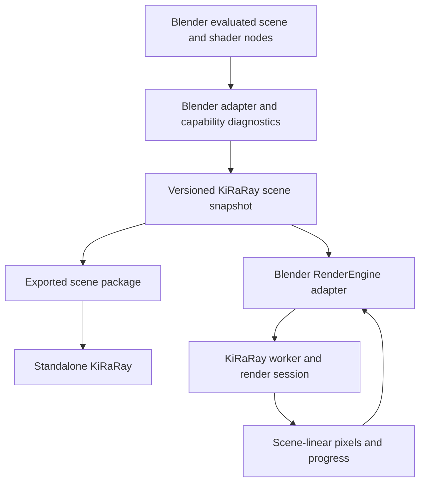

**Blender interoperability: feasibility and proposed direction**

Research date: 2026-09-27. This is a source review and design recommendation, not an implemented or runtime-tested Blender integration. KiRaRay was inspected at revision `33c54a5` with existing working-tree changes. No renderer changes or Blender installation were made for this research.

Both requested goals are feasible with a bounded feature set. A Blender exporter and a Blender render engine should share scene/material conversion. Interactive preview is also feasible, but needs persistent rendering state beyond the current fresh-batch Python API. Broad compatibility with arbitrary Cycles shader graphs is a much larger, continuing renderer project.

| Outcome | Assessment | Main work |
| --- | --- | --- |
| Better Blender assets/scenes in standalone KiRaRay | Practical first milestone | Evaluated geometry, camera/light conventions, reliable material subset |
| Select KiRaRay and render with F12 | Practical once scene conversion works | RenderEngine adapter, worker, pixels, cancellation and errors |
| Progressive rendered viewport | Practical separate milestone | Persistent session, camera updates, redraw scheduling and cleanup |
| Efficient updates for every Blender edit | Substantial extension | Stable identities, dirty tracking, refit/rebuild and resource replacement |
| Arbitrary Cycles scene/material equivalence | Large open-ended scope | Many shading models, attributes, procedural nodes, geometry types and rendering features |

**What Blender provides**

Blender exposes a public Python `RenderEngine` interface for third-party renderers. Its official example covers registration, `render(depsgraph)`, writing the Combined result, and viewport callbacks. Progress, cancellation and additional render passes are supported. A Blender fork is unnecessary for this route. [Official Blender example][blender-engine], [API implementation][blender-rna].

The evaluated dependency graph supplies objects after modifiers, animation and constraints have been evaluated. Exporters can traverse instances, obtain evaluated meshes, read transforms and release temporary mesh data afterward. This avoids reproducing Blender's modeling or animation systems in KiRaRay. It does not produce an executable Cycles shader for an external renderer. [Depsgraph API][blender-depsgraph].

Support should be expressed in terms of evaluated output. A Geometry Nodes object producing triangles may be supported, while hair, point clouds or volumes from another graph may not. Exporting each evaluated animation frame is possible before implementing deformation updates or motion blur. Motion blur additionally needs time samples and corresponding renderer support.

**What KiRaRay already has, and the actual gaps**

The current renderer already provides offscreen graphics initialization, CUDA/OptiX rendering, configurable passes, owned float NumPy output, triangle geometry, shared meshes/instances and several useful light/BSDF types. These are strong foundations for a Blender adapter.

| Area | Current code | Integration consequence |
| --- | --- | --- |
| Import | [Scene dispatch](../../src/scene/krrscene.cpp) supports Assimp formats, PBRT, JSON and volumes | No native `.blend`, USD or MaterialX import; use Blender to evaluate/export |
| Meshes | [Mesh layout](../../src/core/mesh.h): triangles, vertex normals/tangents, one UV channel, one material per mesh | Split vertices at corner attribute seams and partition by material; preserve instances |
| Materials | [Material record](../../src/core/texture.h) and [shading](../../src/render/shading.h): fixed slots/parameters | No general material expression runtime |
| BSDFs | [Variants](../../src/render/bsdf.h) and [Disney implementation](../../src/render/materials/disney.h) | Useful models exist, but the active Disney implementation lists missing thin surfaces, sheen, clearcoat and subsurface |
| Scene updates | [Device scene](../../src/core/device/scene.cpp), [OptiX update](../../src/core/device/optix.cpp) | Material/light/instance hooks and transform refitting exist; arbitrary deformation updates require more work |
| Python | [Bindings](../../src/core/python/py.cpp) | Config-based batch API; no public mesh/material array construction, camera editing, partial-image or cancellation API |
| Session | [Renderer](../../src/main/renderer.cpp) | One active renderer per process; each headless batch recreates scene/passes and destroys them afterward |
| Pixels | [Readback](../../src/core/graphics/rendercontext.cpp), [Python wrapper](../../common/scripts/krr.py) | Owned top-down RGB float32; alpha/AOV delivery needs explicit extension |

There are also concrete limitations in the existing glTF route. [Assimp loading](../../src/scene/assimp.cpp) treats textures as filesystem paths without an embedded-texture lookup, imports UV channel zero, and does not call its existing camera loader. That camera loader also needs its field-of-view conversion corrected before use. [Material evaluation](../../src/render/shading.h) selects texture or factor rather than multiplying them, affecting standard textured PBR semantics. Current [JSON material overrides](../../src/scene/krrscene.cpp) are not a complete scene/material serialization interface.

Hardening these paths would improve everyday Blender asset import independently. However, an integration should not depend on silently working around them for every exported scene.

**Reference implementations and what to borrow**

The inspected Mitsuba add-on revision is `d3df4467fd55e7ec9f36557cdf9f3ee4502dd348` (2026-09-23). Current source differs substantially from older indexed exporter files.

Mitsuba really does provide an F12 render engine. Its [final engine][mitsuba-final] uses a shared `SceneConverter`, renders while polling progress/cancellation, writes render passes, skips its film postprocessing, flips image rows and fills missing alpha. Its [shared converter][mitsuba-converter] serves export and integrated rendering. This is the closest architectural reference for KiRaRay. The inspected final engine disables material previews; it is not evidence of a Cycles-like viewport implementation.

Mitsuba's broader node support depends on runtime support inside the renderer. Its [texture converter][mitsuba-textures] emits Mitsuba math/texture objects; its [Noise implementation][mitsuba-noise] uses `mi.Texture` and DrJit. Copying the Python translator would not add these GPU capabilities to KiRaRay. The [Principled adapter][mitsuba-principled] also makes semantic approximations, while [scalar socket resolution][mitsuba-resolve] can average textured values over a UV grid when the destination only accepts a scalar. This is useful evidence for publishing a precise compatibility policy.

The [current README][mitsuba-readme] describes Blender extension packaging with Python-version-specific wheels. The inspected [CI][mitsuba-ci] explicitly tests Blender 4.2/4.5 plus a development-build schedule; that is not certification of every newer Blender version. Pin and test a chosen version rather than inferring compatibility from installation requirements.

For interactive integration, stronger references are [BlendLuxCore's viewport][luxcore-viewport] and [Radeon ProRender's viewport][rpr-viewport]. They demonstrate persistent sessions, change classification, rendering/display separation, resizing and cleanup. ProRender uploads CPU images into Blender GPU textures. LuxCore checks viewport camera changes during drawing because navigation does not always trigger a scene-update callback. Borrow these lifecycle patterns without importing their entire framework or threading assumptions.

**Recommended shared architecture**



Keep `bpy` dependencies in a dedicated add-on. KiRaRay core should receive owned geometry, instances, materials, lights, cameras and settings. Give scene elements stable identifiers so the same representation can later carry updates. Avoid developing separate material translators for file export, F12 and the viewport.

Start with a small versioned manifest and reusable mesh/texture payloads. Existing geometry formats can carry the first supported scene subset; add binary arrays or direct bindings where necessary. Do not put large vertex arrays into verbose JSON or design a universal DCC interchange standard before the first useful scene works. Extend native scene construction where existing config/import interfaces are insufficient.

Possible organization when implementation begins:

```text
integrations/blender/    Blender registration, extraction, conversion and transport
src/scene/              Renderer-owned scene construction/import
src/core/python/        Native Python session and scene interfaces
tests/blender/          Small Blender fixtures and integration tests
```

No integration scaffolding is created by this research. Existing benchmark and render-test infrastructure should remain independent of the add-on.

**Worker versus in-process integration**

An external KiRaRay worker is the recommended first transport. Blender converts the scene and submits it to a process using KiRaRay's configured Python/build. A file-backed request plus float image result is sufficient for the initial proof; structured messages add progress, cancellation and later session edits. EXR is an appropriate final-image interchange option; a documented binary array protocol is another. Shared memory can follow if measurements justify it.

The current `build/release` cache targets CPython 3.9. That extension cannot be assumed importable in Blender's newer bundled Python. A worker avoids this immediate ABI mismatch and native DLL collisions, isolates native crashes, and fits KiRaRay's one-active-renderer policy. It adds process/serialization costs and can duplicate memory; these need measurement.

In-process pybind11 remains viable for a selected Blender version after rebuilding against its Python and matching native dependencies. It additionally needs GIL handling, cancellation, ownership and safe interaction with multiple Blender engine instances. It may be attractive for a controlled personal build, but is not automatically simpler to distribute.

Offline rendering does not require KiRaRay to adopt Blender's graphics device. Keep the existing headless Vulkan or D3D12 backend and return pixels. For viewport display, CPU readback followed by Blender `GPUTexture` upload is a supported starting point. Recent NVRHI interoperability work does not automatically provide zero-copy texture sharing with Blender.

Use one pinned Blender LTS for the first supported configuration. Validate extension installation, worker discovery, native dependencies and cleanup on that configuration before expanding the matrix. Keep source attribution and third-party redistribution requirements with any borrowed or bundled code.

**A realistic material contract**

Shader support has two distinct layers:

1. Value/color/vector expressions produce parameters: textures, coordinates, math, mixing and ramps.
2. Scattering closures define material behavior: evaluation, sampling, PDFs, mixtures, transmission and layers.

A small typed expression graph feeding KiRaRay's existing BSDFs is a plausible extension. It should grow from demonstrated use cases. Arbitrary Mix Shader/Add Shader support additionally needs correct scattering composition; it is not just another arithmetic node.

The follow-up code audit strengthens the case for separating three layers: material descriptions, parameter evaluation at a hit, and BSDF evaluation/sampling. Give scalar, color and vector inputs explicit types. Allow a parameter to reference a constant, image channel or expression; keep texture packing as an import/storage detail. Evaluate authored color operations in the agreed linear RGB working space and convert reflectance/emission to spectra at a deliberate boundary. Keep a fast path for simple materials and lower supported graphs to a compact program before considering shader JIT compilation.

| Priority | Material-system addition | Practical benefit |
| --- | --- | --- |
| First | Independent parameter inputs; channel selection, factors, UV transforms and color interpretation | Common textured materials no longer depend on five overloaded slots |
| First | Small expression set: add/multiply/mix, clamp, mapping, ramps | Supports everyday image-to-parameter graphs |
| First | Verify shading frames, normal maps, coverage and emission; add height bump afterward | Correct appearance and shadows for ordinary assets |
| Next | Modern Principled model: dielectric specular controls, coat, sheen/fuzz, anisotropy orientation, thin surfaces | Coherent support for coated objects, fabric, glass and sheets |
| Later | Limited closure mixtures, then advanced scattering/geometry | Extend only after evaluation, sampling and PDF contracts are tested |

The audit also found likely existing correctness issues worth focused tests: fractional metallic is applied to diffuse both in `shading.h` and again in Disney setup; rough dielectric sampling and its separately queried PDF use different Fresnel angles. These are source findings, not runtime-confirmed fixes. Normal mapping and stochastic alpha already exist; the task is to correct/generalize their semantics, not introduce them from nothing. Geometric and shading normals, tangent handedness, coverage versus refraction, and emission versus surface reflectance need separate meanings.

Before manually expanding Disney, evaluate [Adobe's OpenPBR implementation][adobe-openpbr] as a source or reusable component. Its [public API][adobe-api] has different cosine/throughput conventions from KiRaRay, and its [color types][adobe-color] require an explicit spectral adaptation. This merits a small isolated port and performance/correctness evaluation before adoption. Preserve the old Disney model for existing configurations and give the new model an explicit identity.

Coat must attenuate underlying scattering; sheen must participate in correct lobe sampling. Subsurface scattering also needs transport through a medium, and true displacement needs geometry/intersection work. Those are not completed by adding socket fields. Useful validation includes parameter math, sampling/PDF agreement, finite values, energy bounds, alpha/shadow consistency and material-sphere regressions. White-furnace expectations must account for intentionally absorbing materials.

Start with Material Output connected to one supported surface model. Translate a documented subset of Principled inputs, constants and image textures, UV coordinates, constant mapping and tangent-space normal maps. Initially limit the UV set and texture addressing modes to implemented behavior. Add multiply/mix/math expressions next; constant-fold them where possible. Traverse groups/reroutes only when the reachable operations are supported.

Current Blender Principled uses an OpenPBR-based layered model. Matching its socket names to KiRaRay's Disney parameters cannot establish equivalent energy behavior, coat, sheen, subsurface or transmission. Describe approximations explicitly and test each supported input. [Blender Principled documentation][blender-principled].

Unsupported reachable inputs should produce diagnostics identifying material, node and socket. Final rendering should fail clearly or use an unmistakable error material; an explicitly selected relaxed preview can substitute approximations. Disconnected unsupported nodes need not block a supported material. Never silently use a linked socket's unused default and call the graph supported.

Baking is useful for suitable view-independent parameter maps, including some procedural color/roughness inputs. It requires appropriate UVs, resolution and seam margins; object/generated-coordinate inputs may require different bakes per object. It cannot generally preserve ray/view-dependent behavior, complete scattering closures, volumes or displacement. Baking already shaded Combined output into base color also changes subsequent lighting behavior. [Blender baking documentation][blender-baking].

**Format and shading-runtime alternatives**

| Option | Benefit | Why it is not the recommended first foundation |
| --- | --- | --- |
| glTF plus KiRaRay settings | Quick improvement for conventional PBR assets | Blender's exporter omits area lights/world lighting and does not preserve arbitrary shader graphs; importer extensions also need support |
| USD plus MaterialX | Broader scene/material interchange | KiRaRay still needs scene import and execution of the supported material semantics |
| Hydra render delegate | Reuse Blender's Hydra scene bridge and potentially serve other DCCs | Adds a C++ delegate, OpenUSD ABI/build dependencies, resource synchronization, render buffers and material translation |
| OSL on CUDA/OptiX | A programmable shading runtime with existing GPU support | Requires compiler/runtime integration, renderer services, attributes/textures and closure implementations |

Sources: [Blender glTF][blender-gltf], [Blender USD][blender-usd], [MaterialX shader generation][materialx], [OSL GPU build support][osl]. MaterialX generates shader source and does not supply a renderer runtime. OSL does support CUDA/OptiX; it should not be dismissed as CPU-only. Neither automatically implements Cycles' scattering models.

Hydra deserves a stronger evaluation than simply treating it as a multi-DCC option. Blender's [official Hydra example][blender-hydra] selects a renderer delegate and can request MaterialX rather than USD Preview Surface. The inspected Blender 5.2.2 [engine][blender-hydra-engine] feeds evaluated data directly through a Hydra scene index on its fast path; it does not require serializing an entire USD file for each change. Renderer creation still uses `HdRenderDelegate`, so a pure Hydra 2 renderer rewrite is unnecessary for this host.

Its [mesh bridge][blender-hydra-mesh] already translates triangles, per-material parts, normals and active UVs. The [material bridge][blender-hydra-material] reuses Blender's MaterialX/Preview Surface conversion and builds a network for the renderer. KiRaRay would consume that standard network rather than interpret Blender sockets itself. It must still support the actual network nodes and scattering semantics; unsupported conversion or fallback can lose information upstream.

A concrete connection to the material roadmap is visible in Blender 5.2.2's [Principled exporter][blender-principled-source]: its surface-shader path emits MaterialX `open_pbr_surface`. Supporting that node and a bounded set of parameter expressions can cover a useful common case. When Principled participates in a BSDF-composition context, the exporter instead emits lower-level scattering and layer nodes; one uber-material implementation cannot consume every resulting graph. The conversion also contains explicit approximations, including anisotropy remapping. Inspect actual exported fixtures and pin their producer version before defining the accepted MaterialX subset.

The [viewport implementation][blender-hydra-viewport] supplies viewport-camera conversion, render borders, AOV retrieval and display, and redraws until convergence. It requests color and depth, so a KiRaRay prototype needs appropriate render-buffer outputs rather than assuming RGB alone is sufficient. This is substantial reuse for the optional interactive goal.

The remaining delegate work includes supported mesh/instance/light/material translation into KiRaRay resources, texture/attribute handling, persistent rendering, dirty-state reactions, convergence, cancellation and AOV buffers. Hydra signals edits but does not refit KiRaRay's acceleration structures or reset its accumulation. OpenUSD's [HdEmbree example][hdembree] illustrates the renderer responsibilities.

Coverage still depends on the host bridge: inspected code exports the active UV set, not every named attribute; some light conversions are approximations. A native delegate normally loads into the host process and must match its OpenUSD ABI/dependency build. It can call KiRaRay C++ directly and avoid its Python-module ABI, but external-worker isolation would require an additional transport layer.

For standalone interchange, Blender can export a USD stage, which a USD imaging host feeds into the same delegate. [USD tools][usd-tools] include `usdview` and `usdrecord`. Alternatively KiRaRay can implement a direct USD importer; adding a delegate alone does not make the existing KiRaRay CLI understand USD files. Prefer sharing one material lowering layer across whichever routes are chosen.

Direct RenderEngine remains the smaller dependency surface for a minimal F12 prototype. However, before writing an extensive custom Blender converter and viewport adapter, test a small Hydra delegate against the chosen Blender build and a textured fixture. Its greater reuse may justify the native build cost for this project's combined scene, material and preview goals. Material-system improvements remain useful under either integration route.

**Interactive preview: useful without implementing all of Cycles**

A refresh-after-edit prototype is easy to stage: debounce changes, render a small snapshot, retain the old image and discard obsolete results. This can validate viewport camera conversion and transport. However, keeping a worker alive does not make the current fresh-batch API progressive: every batch reloads scene/passes, resets sampling and returns only at completion. Repeating the same seed returns the same samples. Startup latency has not been measured.

The first useful progressive milestone should retain scene and GPU resources, render additional samples in bounded batches, retrieve snapshots and update the camera cheaply. Initially rebuild the scene for geometry/material changes. That already gives navigation and stationary convergence without implementing efficient handling of every edit.

Extract a persistent session lifecycle from the common `Renderer` machinery: load, step samples, snapshot, update camera, resize/reset, stop and close. Do not reuse the GLFW/ImGui/presentation loop in `RenderApp::run()`. Preserve the documented fresh-batch behavior of `krr.render()` and `HeadlessRenderer.render()` by making each batch use a fresh session internally. Advance sample state across steps, and add explicit history invalidation for edits. Keep update/frame sequence numbers monotonic where existing scene and accumulation code compares them; define sample-sequence resets separately.

The local code audit identified several concrete traps. Blender must own its camera transform, so KiRaRay's orbit controller must not overwrite it during `Scene::update`. Resize must update film aspect, targets, pass allocations and accumulation together. Scene replacement should recreate passes through the existing cleanup/initialization path until their independent reuse is verified. Synchronize before replacing GPU resources and serialize state edits with rendering. Intermediate snapshots must not call pass finalization: the accumulation pass can save files there, and some end-of-frame behavior can request application exit. Separate offline completion, viewport publication and cleanup.

Blender integration uses `view_update()` for scene changes and `view_draw()` for display and lightweight viewport-state checks. The viewport camera is not necessarily `scene.camera`: view matrix, perspective/orthographic mode, lens, zoom and camera offset matter. ProRender's [camera adapter][rpr-camera] is a concrete reference. Start with supported perspective navigation and explicitly report other modes until implemented.

Keep full export and blocking GPU work out of drawing callbacks. Upload the newest available image through Blender's GPU API and request redraws through supported callback/timer paths. Workers receive owned snapshots, not `bpy` references. Blender warns against arbitrary Python threads accessing its data. [Official threading guidance][blender-threading].

Initially support one active rendered viewport, suspend it for F12, and disable material thumbnails. Associate work with a session and scene generation so stale images cannot replace current ones. Cancel and clean up when an area closes, the engine changes, a file is loaded or the extension is disabled. Cooperative cancellation between bounded render steps is preferable to repeatedly terminating the worker.

Render iteration rate and display refresh should be independent. A starting experiment could upload images at 5–10 Hz, reduce resolution during navigation and accumulate at full resolution while stationary. These are tuning proposals, not KiRaRay performance results. Standalone window FPS does not predict Blender responsiveness because export, rebuild, synchronization and image transfer can dominate.

**Color and output need an explicit contract**

Return scene-linear HDR without KiRaRay tone mapping, then let Blender apply its view/display transform. Decode color textures according to their declared spaces while treating roughness, normals and other data channels as non-color. Blender 5.2 permits Linear Rec.709, Linear Rec.2020 and ACEScg working spaces; KiRaRay currently defaults to sRGB/Rec.709 primaries. Initially require Linear Rec.709 with a clear compatibility check, or implement the necessary conversions. Do not silently reinterpret another working space. [Blender color spaces][blender-color].

Start with the Combined result. Current KiRaRay Python output is RGB, so an opaque first scope can provide alpha one; transparent film requires real coverage/alpha semantics. Verify row order and channel order with a known-color corner image. AOVs should later have explicit channel definitions and accumulation behavior. The presence of internal G-buffers does not automatically expose valid Blender render passes.

Spectral reconstruction and different BSDF implementations can produce legitimate differences from Cycles. Universal pixel identity with Cycles is therefore unsuitable as an acceptance criterion.

**Suggested sequence and acceptance**

The following are proposed compatibility and performance constraints, not measured outcomes. Preserve existing JSON/import paths, pass configurations, Python batch behavior and material defaults. Keep Hydra/OpenUSD dependencies in an optional integration target. A new material model should be explicitly selected; correctness fixes that alter old images should be separately validated and documented.

Prepare materials once into constant, simple-image or general-expression paths. Existing simple scenes should not be forced through an interpreter. Use a typed intermediate representation with explicit bindings so an interpreter and a future JIT can share semantics. Keep graph structure separate from editable parameter data; ordinary parameter edits should not require recompilation. Preserve model-specific terminal semantics even when Preview Surface and MaterialX share expression infrastructure.

Evaluate surface inputs once per interaction and reuse the results for BSDF evaluation/sampling. Opacity traversal should execute only the opacity dependency slice, and known-opaque materials should bypass it. Keep transient interpreter storage out of persistent wavefront hit queues. Adding a large BSDF alternative can also increase the shared variant's maximum storage and kernel register pressure, so a fast branch alone is not sufficient evidence of unchanged performance.

No credible slowdown percentage is available before implementation. Measure unchanged legacy scenes, equivalent materials expressed through simple and general paths, and genuinely richer materials separately. Use ordinary benchmark runs for throughput, profiler captures for instruction/register/memory diagnosis, and separate measurements for scene loading, first image and edit latency. Compare convergence as well as per-sample cost when scattering models differ.

Hydra does not require replacing KiRaRay's scene graph or implementing Blender's animation system. Add a persistent session and stable external-ID mappings with safe batched updates. Blender evaluates externally controlled animation; KiRaRay consumes the results without applying its own animation again. Camera changes should preserve geometry; geometry/deformation can initially rebuild before finer update support is added. Motion blur remains a separate time-sampling feature.

The material choice is between a small `UsdPreviewSurface` subset and richer MaterialX/OpenPBR coverage, not between USD scene loading and MaterialX. Both can use the same Hydra geometry/update path. A small Preview Surface case can prove integration while the common material architecture is designed for the richer target.

1. **One exportable fixture.** Pin Blender, extract evaluated meshes/instances/camera, support basic materials and mesh/environment lighting, write a reusable scene package, and render it in standalone KiRaRay. Check seams, transforms, materials and camera framing. Fix importer limitations actually exercised by this path.
2. **F12 integration.** Reuse the same converter in a minimal RenderEngine and external worker. Deliver scene-linear Combined, clear diagnostics, cancellation and repeatable cleanup. Test two consecutive renders, failure recovery and worker shutdown. No material thumbnails initially.
3. **Progressive session.** Reuse core pass execution, keep scene/resources alive, add bounded sample stepping, snapshot, camera/reset/resize and cancellation. Keep existing batch tests passing. Demonstrate increasing sample counts without reloading geometry.
4. **Rendered viewport.** Support one perspective viewport, camera navigation and stationary convergence. Rebuild after other edits initially; serialize F12 with preview. Measure first-new-image latency, cancel latency, redraw cost and memory across repeated enter/leave/resize cycles.
5. **Expand from real scenes.** Add material expressions, selected AOVs, packed-image handling and incremental instance/material updates as required. Consider orthographic cameras, richer animation and additional Blender versions. Defer hair, arbitrary volumes/displacement and broad closure parity until there is a concrete need.

Scene conversion fixtures should cover UV seams, split normals, per-face materials, shared instances, negative/nonuniform transforms, unit scale, camera fit, normal orientation, textured material factors, light units and environment rotation. Output tests should cover color spaces, alpha policy and image orientation. CPU conversion checks can run in background Blender on CI; GPU regression and viewport lifecycle tests can remain local, matching the existing project policy.

Use analytic checks and known supported material cases to compare semantics with Cycles. Use KiRaRay reference renders to detect regressions in its own supported behavior. Add tests that verify unsupported inputs produce actionable diagnostics.

The recommended first implementation target is one small Blender scene that can both export to standalone KiRaRay and render with F12 through the same translator. Design its identities and session boundary for the optional progressive viewport, then implement that viewport as a distinct milestone. Neither goal requires full shader-graph parity before it becomes useful.

[blender-engine]: https://github.com/blender/blender/blob/v5.2.2/doc/python_api/examples/bpy.types.RenderEngine.1.py
[blender-rna]: https://github.com/blender/blender/blob/v5.2.2/source/blender/makesrna/intern/rna_render.cc
[blender-depsgraph]: https://docs.blender.org/api/5.2/bpy.types.Depsgraph.html
[blender-principled]: https://docs.blender.org/manual/en/5.2/render/shader_nodes/shader/principled.html
[blender-color]: https://docs.blender.org/manual/en/5.2/render/color_management/color_spaces.html
[blender-baking]: https://docs.blender.org/manual/en/5.2/render/cycles/baking.html
[blender-gltf]: https://docs.blender.org/manual/en/5.2/addons/scene_gltf2.html
[blender-usd]: https://docs.blender.org/manual/en/5.2/files/import_export/usd.html
[blender-hydra]: https://github.com/blender/blender/blob/v5.2.2/doc/python_api/examples/bpy.types.HydraRenderEngine.0.py
[blender-threading]: https://github.com/blender/blender/blob/v5.2.2/doc/python_api/rst/info_gotchas_threading.rst
[mitsuba-readme]: https://github.com/mitsuba-renderer/mitsuba-blender/blob/d3df4467fd55e7ec9f36557cdf9f3ee4502dd348/README.md
[mitsuba-final]: https://github.com/mitsuba-renderer/mitsuba-blender/blob/d3df4467fd55e7ec9f36557cdf9f3ee4502dd348/mitsuba_blender/engine/final.py
[mitsuba-converter]: https://github.com/mitsuba-renderer/mitsuba-blender/blob/d3df4467fd55e7ec9f36557cdf9f3ee4502dd348/mitsuba_blender/io/exporter/__init__.py
[mitsuba-textures]: https://github.com/mitsuba-renderer/mitsuba-blender/blob/d3df4467fd55e7ec9f36557cdf9f3ee4502dd348/mitsuba_blender/convert/export/materials/textures.py
[mitsuba-noise]: https://github.com/mitsuba-renderer/mitsuba-blender/blob/d3df4467fd55e7ec9f36557cdf9f3ee4502dd348/mitsuba_blender/plugins/textures/tex_noise.py
[mitsuba-principled]: https://github.com/mitsuba-renderer/mitsuba-blender/blob/d3df4467fd55e7ec9f36557cdf9f3ee4502dd348/mitsuba_blender/convert/export/materials/principled.py
[mitsuba-resolve]: https://github.com/mitsuba-renderer/mitsuba-blender/blob/d3df4467fd55e7ec9f36557cdf9f3ee4502dd348/mitsuba_blender/convert/export/materials/_resolve.py
[mitsuba-ci]: https://github.com/mitsuba-renderer/mitsuba-blender/blob/d3df4467fd55e7ec9f36557cdf9f3ee4502dd348/.github/workflows/test.yml
[luxcore-viewport]: https://github.com/LuxCoreRender/BlendLuxCore/blob/5e204a72e0a2a9b71c04eb7175be0d10ed29b79e/engine/viewport.py
[rpr-viewport]: https://github.com/GPUOpen-LibrariesAndSDKs/RadeonProRenderBlenderAddon/blob/fe7a104a618442813b681d989a3a3af3537d198f/src/rprblender/engine/viewport_engine.py
[rpr-camera]: https://github.com/GPUOpen-LibrariesAndSDKs/RadeonProRenderBlenderAddon/blob/fe7a104a618442813b681d989a3a3af3537d198f/src/rprblender/export/camera.py
[materialx]: https://github.com/AcademySoftwareFoundation/MaterialX/blob/main/documents/DeveloperGuide/ShaderGeneration.md
[osl]: https://github.com/AcademySoftwareFoundation/OpenShadingLanguage/blob/main/INSTALL.md
[hdembree]: https://openusd.org/dev/api/hd_embree_page_front.html
[adobe-openpbr]: https://github.com/adobe/openpbr-bsdf
[adobe-api]: https://github.com/adobe/openpbr-bsdf/blob/main/openpbr_api.h
[adobe-color]: https://github.com/adobe/openpbr-bsdf/blob/main/openpbr_diffuse_specular.h
[blender-hydra-engine]: https://github.com/blender/blender/blob/v5.2.2/source/blender/render/hydra/engine.cc
[blender-hydra-mesh]: https://github.com/blender/blender/blob/v5.2.2/source/blender/io/usd/hydra/mesh.cc
[blender-hydra-material]: https://github.com/blender/blender/blob/v5.2.2/source/blender/io/usd/hydra/material.cc
[blender-hydra-viewport]: https://github.com/blender/blender/blob/v5.2.2/source/blender/render/hydra/viewport_engine.cc
[usd-tools]: https://openusd.org/dev/toolset.html
[blender-principled-source]: https://github.com/blender/blender/blob/v5.2.2/source/blender/nodes/shader/nodes/node_shader_bsdf_principled.cc
