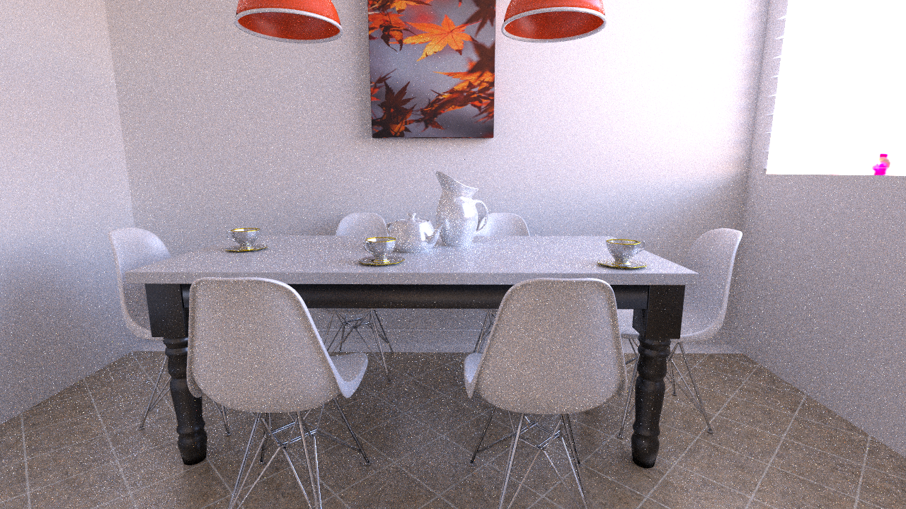

# KiRaRay Python Binding

## Denoising Images

Kiraray implements a python wrapper for denoising images with optix's built-in ai denoiser. See `denoise.py` for an example. To denoise an image, the hdr noisy image is provided as arguments, with optionally the normals and albedo (in linear space). All arguments are numpy arrays.

~~~Python
img_denoised = pykrr.denoise(img_noisy, img_normals, img_albedo)
~~~

<table>
  <tr>
    <td>Noisy</td>
    <td>Denoised</td>
  </tr>
  <tr>
    <td></td>
    <td></td>
  </tr>
 </table>